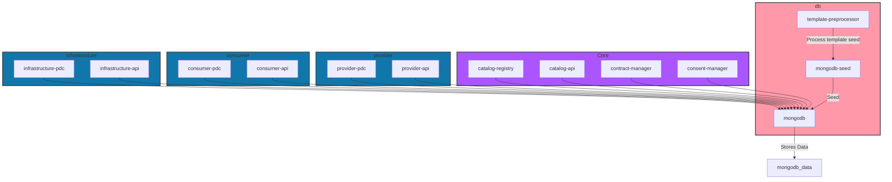

# PTX-Docker

## Overview

The PTX-Docker project utilizes Docker Compose to provide a comprehensive PTX application environment. This setup allows for easy deployment, scaling, and management of the various components.



### Docker Compose Services

The `docker-compose.yml` file defines the services that make up the application. Each service is configured with its own settings, including build context, environment variables, ports, and dependencies. Below is a brief overview of the services defined in the `docker-compose.yml`:

### Services

1. **mongodb**: 
   - Container for MongoDB, the database used by the application.
   - Uses a volume for persistent data storage.
   - Exposed on port `27018`.

2. **mongodb-seed**: 
   - Initializes the MongoDB database with seed data.
   - Depends on the `mongodb` service to be running.
   - Environment variables:
     - `CATALOG_REGISTRY_MONGO_DATABASE`: Database name for the catalog registry.
     - `CATALOG_MONGO_DATABASE`: Database name for the catalog.
     - `CONTRACT_MONGO_DATABASE`: Database name for contracts.
     - `CONSENT_MONGO_DATABASE`: Database name for consent management.
     - `PROVIDER_PDC_DATABASE`: Database name for provider PDC.
     - `CONSUMER_PDC_DATABASE`: Database name for consumer PDC.

3. **template-preprocessor**: 
   - Processes templates for seed data initialization.
   - Depends on the `mongodb-seed` service to be running.

4. [**catalog-registry**](https://github.com/Prometheus-X-association/catalog-registry): 
   - Manages the catalog of items in the application.
   - Exposes ports defined by `CATALOG_REGISTRY_BINDING_PORT` and `CATALOG_REGISTRY_PORT`.

5. [**catalog-api**](https://github.com/Prometheus-X-association/catalog-api):  
   - Provides an API for accessing catalog data.
   - Exposes ports defined by `CATALOG_BINDING_PORT` and `CATALOG_PORT`.

6. [**contract-manager**](https://github.com/Prometheus-X-association/contract-manager): 
   - Manages contracts within the application.
   - Exposes ports defined by `CONTRACT_BINDING_PORT` and `CONTRACT_SERVER_PORT`.

7. [**consent-manager**](https://github.com/Prometheus-X-association/consent-manager): 
   - Handles user consent management.
   - Exposes ports defined by `CONSENT_BINDING_PORT` and `CONSENT_PORT`.

8. [**provider-pdc**](https://github.com/Prometheus-X-association/dataspace-connector): 
   - Represents the provider service.
   - Exposes ports defined by `PROVIDER_PDC_BINDING_PORT` and `PROVIDER_PDC_PORT`.

9. [**consumer-pdc**](https://github.com/Prometheus-X-association/dataspace-connector): 
   - Represents the consumer service.
   - Exposes ports defined by `CONSUMER_PDC_BINDING_PORT` and `CONSUMER_PDC_PORT`.

10. [**infrastructure-pdc**](https://github.com/Prometheus-X-association/dataspace-connector): 
    - Represents the infrastructure service.
    - Exposes ports defined by `INFRASTRUCTURE_PDC_BINDING_PORT` and `INFRASTRUCTURE_PDC_PORT`.

11. [**example-api**](https://github.com/VisionsOfficial/sandbox-participant.git)(consumer-api/provider-api/infrastructure-api): 
    - Provides an API for infrastructure services.
    - Exposes ports defined by `INFRASTRUCTURE_API_BINDING_PORT` and `INFRASTRUCTURE_API_PORT`.
    - Exposes ports defined by `CONSUMER_API_BINDING_PORT` and `CONSUMER_API_PORT`.
    - Exposes ports defined by `PROVIDER_API_BINDING_PORT` and `PROVIDER_API_PORT`.

### Profiles

Profiles in Docker Compose allow you to define a subset of services that can be started together. This is useful for running different configurations of your application without modifying the `docker-compose.yml` file. For example, you can run only the database services or only the core application services by specifying the profile when starting Docker Compose.

#### Available Profiles

Profiles can be combined to run multiple configurations at once.

1. **Core Profile**
   - This profile includes the core application services necessary for the main functionality of the application. It typically includes services like `catalog-registry`, `catalog-api`, `contract-manager`, and `consent-manager`.
   - To run the core profile, use the following command:

     ```bash
     docker-compose --profile core up
     ```

2. **Database Profile**
   - This profile includes the database-related services, primarily the `mongodb`, `template-preprocessor` and `mongodb-seed` services. It is useful for initializing and managing the database without starting the entire application.
   - To run the database profile, use the following command:

     ```bash
     docker-compose --profile db up
     ```

3. **provider Profile**
   - This profile includes the provider PDC service and an example API, which are essential for handling PDC interactions within the application.
   - To run the provider profile, use the following command:

     ```bash
     docker-compose --profile provider up
     ```

4. **consumer Profile**
   - This profile includes the consumer PDC service and an example API, which are essential for handling PDC interactions within the application.
   - To run the consumer profile, use the following command:

     ```bash
     docker-compose --profile consumer up
     ```

5. **infrastructure Profile**
   - This profile includes the infrastructure PDC service and an example API, which are essential for handling PDC interactions within the application.
   - To run the infrastructure profile, use the following command:

     ```bash
     docker-compose --profile infrastructure up
     ```

#### Running multiple Profiles

 ```bash
docker-compose --profile core --profile db up
 ```

#### Running All Profiles

If you want to run all services defined in the `docker-compose.yml` file, you can simply use the following command without specifying a profile:

```bash
docker-compose --profile "*" up -d
```

### Configuration Check Script

Before starting the application with Docker Compose, it is recommended to run the configuration check script to ensure that all environment variables and configurations are set correctly. The script is located at `ptx-docker/check-configuration.sh`.

#### How to Run the Configuration Check

1. Ensure that the `.env` file is present and correctly configured.
2. Run the following command:

```bash
bash ptx-docker/check-configuration.sh
```

The script performs the following checks:

- Validates the Docker Compose configuration.
- Checks for the existence of the `.env` file.
- Verifies that there are no duplicate ports defined in the `.env` file.
- Ensures that the `PORT` values for the consumer and provider services match the expected values.
- Constructs and verifies the expected URIs for various services, updating them in the configuration files if necessary.

If any issues are found, the script will output error messages indicating what needs to be corrected.

### Environment Variables (.env File)

The `.env` file is a crucial component of the PTX-Docker project, as it defines the environment variables used by the various services in the Docker Compose configuration. These variables allow for easy configuration and customization of the application without modifying the source code directly.

#### Structure of the .env File

The `.env` file contains key-value pairs that specify various settings for the application. Below are the main sections and variables defined in the `.env` file:

1. **Catalog Registry**
   - `CATALOG_REGISTRY_API_KEY`: API key for the catalog registry service.
   - `CATALOG_REGISTRY_NODE_ENV`: Environment setting (e.g., development or production).
   - `CATALOG_REGISTRY_PORT`: Port on which the catalog registry service runs.
   - `CATALOG_REGISTRY_BINDING_PORT`: Port exposed for external access.
   - `CATALOG_REGISTRY_MONGO_*`: MongoDB configuration settings for the catalog registry.

2. **Catalog**
   - `CATALOG_NODE_ENV`: Environment setting for the catalog service.
   - `CATALOG_PORT`: Port for the catalog service.
   - `CATALOG_BINDING_PORT`: Port exposed for external access.
   - `CATALOG_MONGO_*`: MongoDB configuration settings for the catalog.

3. **Contract**
   - `CONTRACT_NODE_ENV`: Environment setting for the contract service.
   - `CONTRACT_SERVER_PORT`: Port for the contract service.
   - `CONTRACT_BINDING_PORT`: Port exposed for external access.
   - `CONTRACT_MONGO_*`: MongoDB configuration settings for the contract.

4. **Consent**
   - `CONSENT_NODE_ENV`: Environment setting for the consent service.
   - `CONSENT_PORT`: Port for the consent service.
   - `CONSENT_BINDING_PORT`: Port exposed for external access.
   - `CONSENT_MONGO_*`: MongoDB configuration settings for the consent.

5. **Provider, Consumer and Infrastructure PDC**
   - `PROVIDER_PDC_PORT`: Port for the provider PDC service.
   - `PROVIDER_PDC_BINDING_PORT`: Port exposed for external access.
   - `CONSUMER_PDC_PORT`: Port for the consumer PDC service.
   - `CONSUMER_PDC_BINDING_PORT`: Port exposed for external access.
   - `INFRASTRUCTURE_PDC_PORT`: Port for the infrastructure PDC service.
   - `INFRASTRUCTURE_PDC_BINDING_PORT`: Port exposed for external access.

6. **MongoDB**
   - `MONGODB_DOCKER_NAME`: Name of the MongoDB Docker container.
   - `MONGODB_SEED_DOCKER_NAME`: Name of the MongoDB seed Docker container.
   - `MONGODB_PORT`: Port for the MongoDB service.
   - `MONGODB_DOCKER_PORT`: Port used by the MongoDB container.

#### Usage

To customize the application, you can modify the values in the `.env` file according to your environment and requirements. Ensure that the `.env` file is present in the root directory of the project before running the Docker Compose commands.

### Preconfiguration of the .env File

#### Internal and External Ports

Below is a summary of the internal and external ports used for each service defined in the `.env` file:

| Service                | Internal Port | External Port | Description                                           |
|-----------------------|---------------|---------------|-------------------------------------------------------|
| **mongodb**           | 27017         | 27018         | The MongoDB database service.                         |
| **mongodb-seed**      | N/A           | N/A           | Initializes the MongoDB database with seed data.     |
| **catalog-registry**   | 3000          | 3000          | Manages the catalog of items in the application.      |
| **catalog-api**       | 3001          | 4040          | Provides an API for accessing catalog data.           |
| **contract-manager**  | 3002          | 8888          | Manages contracts within the application.             |
| **consent-manager**   | 3003          | 8887          | Handles user consent management.                       |
| **provider-pdc**      | 3004          | 3333          | Represents the provider service.                       |
| **consumer-pdc**      | 3006          | 3335          | Represents the consumer service.                       |
| **infrastructure-pdc**| 3008          | 3337          | Represents the infrastructure service.                 |
| **provider-api**      | 3005          | 3334          | Example API used in representation                 |
| **consumer-api**      | 3007          | 3336          | Example API used in representation                 |
| **infrastructure-api**| 3009          | 3338          | Example API used in representation                 |

#### Explanation of Ports

- **Internal Ports**: These are the ports on which the services listen for incoming requests within the Docker network. They are used for communication between services.
- **External Ports**: These are the ports exposed to the host machine, allowing external access to the services. They are mapped to the internal ports to facilitate communication from outside the Docker network.

### Data Seed

This section provides an overview of the seed data used in the project. The seed data is essential for initializing the database with sample records that can be used for testing and development purposes.

#### Purpose

The seed data is designed to populate the MongoDB database with initial records for various entities, including participants, service offerings, and contracts. This allows developers to test the application with realistic data without needing to manually create records.

#### Structure

The seed data is organized into several JSON files located in the `ptx-docker/images/mongodb-seed/init/` directory. Each file corresponds to a specific entity type and follows the naming convention `database.collection.json`, where `database` is the name of the MongoDB database and `collection` is the name of the collection within that database.

- **catalog.datarepresentations.json**: Contains representations of data resources.
- **catalog.dataresources.json**: Lists the data resources available in the system.
- **catalog.ecosystems.json**: Defines the ecosystems that the data resources belong to.
- **catalog.globaldatatypes.json**: Specifies the global data types used across the application.
- **catalog.globalpurposes.json**: Outlines the global purposes for which data can be used.
- **catalog.organizationadmins.json**: Contains information about organization administrators.
- **catalog.participants.json**: Lists the participants in the ecosystem.
- **catalog.serviceofferings.json**: Describes the service offerings available.
- **catalog.softwarerepresentations.json**: Details the software representations.
- **catalog.softwareresources.json**: Lists the software resources available.
- **contract.contracts.json**: Contains contract definitions between participants.

#### Usage

The seed data is automatically loaded into the MongoDB database using the provided templates, which are processed to match the variables defined in the `.env` file.

#### The participant

Two participant are created, you can login using: 
```bash
{
    "email": "test-dataprovider@yopmail.com",
    "password": "test"
}
```
```bash
{
    "email": "test-dataconsumer@yopmail.com",
    "password": "test"
}
```

## Getting started

### Clone the project

```bash
git clone https://github.com/Prometheus-X-association/ptx-docker.git
```

### Copy the .env file

```bash
cp .env.sample .env
```

### Check the configuration

```bash
./check-configuration.sh
```

#### expected output

```bash
✅  Configuration check passed
```

### Run the docker compose

```bash
docker compose --profile "*" up -d --build
```

## How to use a local pdc

### As Provider

### As Infrastructure

### As Consumer

## Troubleshooting

### Known issue
